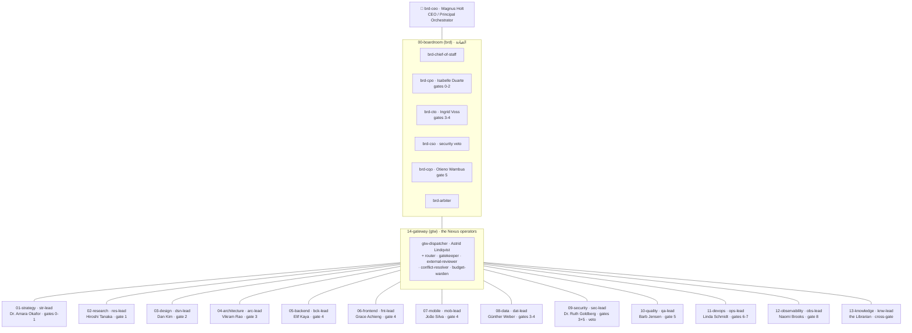
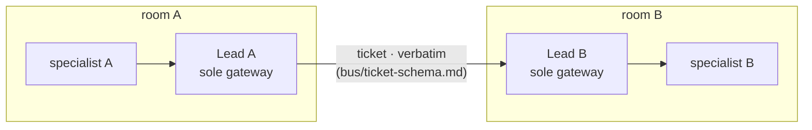
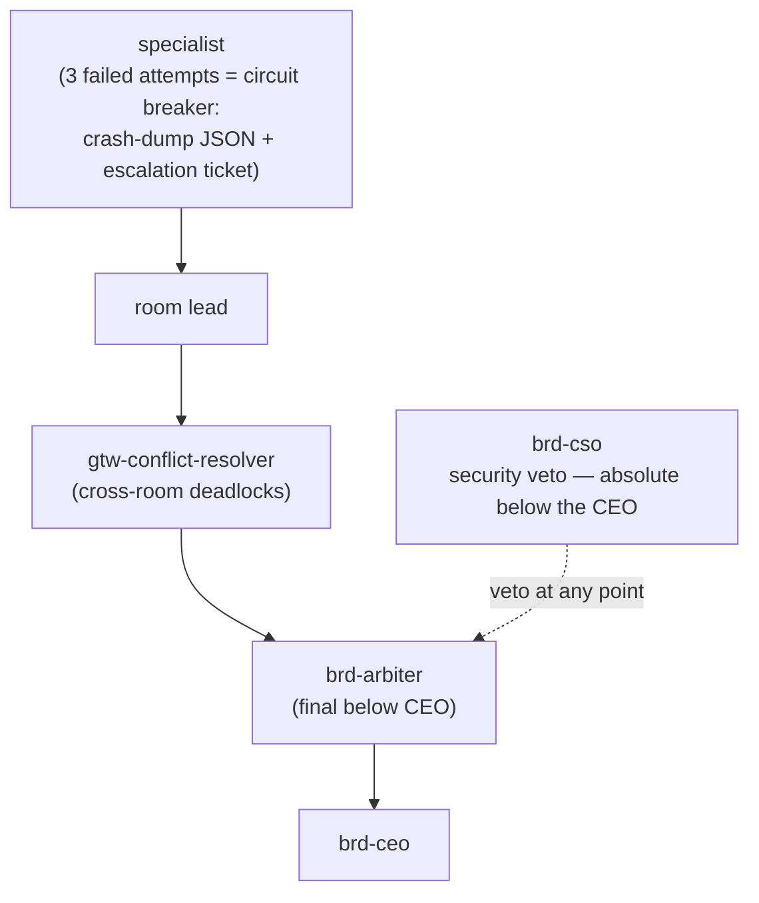

# 🏢 ORG.md — SOFI v6 · 15 rooms (غرف) · 105 agents

> **Design is Truth · few token do trick · big brain small mouth.** 🪨
> The frozen roster (BLUEPRINT §4). Ids, personas, and routes here are the single human-readable mirror of `company/nexus/registry.yaml` — the registry is machine truth; `sofi doctor` enforces 105↔105 parity between `company/rooms/*/agents/` and `.claude/agents/`.
> ★ = persona inherited from v5 (`company/brain/org/PERSONAS.md`). Full spec per agent: `company/rooms/<NN-room>/agents/<id>.md`. Per-agent effort · caveman · budget: `company/nexus/routing.yaml`.
> Route ladder: 🟢 mechanical `haiku` · 🔵 workhorse `sonnet` · 🔮 gatekeeper (`model: inherit`, gatekeeper-tier) · 🟣 deep `opus`.

## The chart

Every room's **Lead is its sole gateway** (Room Isolation Law, `company/nexus/NEXUS.md`). The boardroom and the gateway room may address any Lead; nobody else crosses a room wall.

## The roster — 105, frozen

### 00-boardroom (brd) — القيادة · 7 · all gates
| id | persona | role | route | gate |
|---|---|---|---|---|
| brd-ceo | ★ Magnus Holt | CEO / Principal Orchestrator — owns lifecycle, routes, arbitrates; never writes code | 🔮 gatekeeper | all |
| brd-chief-of-staff | new | raw intent → Work Orders; keeps org state current | 🔵 workhorse | all |
| brd-cpo | ★ Isabelle Duarte (was T0 advisor) | Chief Product Officer — accountable gates 0–2 | 🔮 gatekeeper | 0–2 |
| brd-cto | ★ Ingrid Voss (was T1 advisor) | Chief Technology Officer — accountable gates 3–4 | 🔮 gatekeeper | 3–4 |
| brd-cso | new | Chief Security Officer — company-wide security veto | 🔮 gatekeeper | all |
| brd-cqo | ★ Otieno Wambua (was T3 advisor) | Chief Quality Officer — accountable gate 5 verdicts | 🔮 gatekeeper | 5 |
| brd-arbiter | new | cross-room dispute arbitration (Design-vs-Dev); final below CEO | 🔮 gatekeeper | all |

### 01-strategy (str) · 7 · gates 0–1
| id | persona | role | route | gate |
|---|---|---|---|---|
| str-lead | ★ Dr. Amara Okafor | Room Lead / gateway | 🔮 gatekeeper | 0–1 |
| str-product-strategist | new | problem statement, scope boundary, 5 deep questions | 🔮 gatekeeper | 0 |
| str-business-analyst | new | requirements, success metrics, acceptance criteria | 🔵 workhorse | 0–1 |
| str-market-analyst | new | market sizing, positioning | 🔵 workhorse | 0 |
| str-roadmap-planner | new | milestones, backlog, two-track sizing | 🔵 workhorse | 0–1 |
| str-risk-analyst | new | business risk register, kill criteria | 🔵 workhorse | 0 |
| str-monetization-strategist | new | pricing, business model | 🔵 workhorse | 0 |

### 02-research (res) · 7 · gate 1
| id | persona | role | route | gate |
|---|---|---|---|---|
| res-lead | ★ Hiroshi Tanaka | Room Lead / gateway | 🔵 workhorse | 1 |
| res-ux-researcher | new | evidence-grounded personas, pain/gain map | 🔵 workhorse | 1 |
| res-journey-architect | ★ Sofia Marchetti | Customer Journey Map (Mermaid) — the Design Truth | 🔮 gatekeeper | 1 |
| res-web-scout | new | search/fetch/verify/cite (holds Web tools) | 🟢 mechanical | 1 |
| res-competitor-analyst | new | competitor teardowns | 🔵 workhorse | 1 |
| res-data-researcher | new | quantitative evidence, surveys, telemetry mining | 🔵 workhorse | 1 |
| res-fact-checker | new | adversarial claim verification (G1–G5 enforcer) | 🔵 workhorse | 1 |

### 03-design (dsn) · 8 · gate 2
| id | persona | role | route | gate |
|---|---|---|---|---|
| dsn-lead | ★ Daniel "Dan" Kim | Room Lead / gateway; owns Gate-2 freeze | 🔵 workhorse | 2 |
| dsn-ui-designer | new | textual hi-fi prototype spec, 1:1 journey mapping | 🔵 workhorse | 2 |
| dsn-ux-architect | new | flows, information architecture, interaction models | 🔵 workhorse | 2 |
| dsn-design-system | new | tokens, component library | 🔵 workhorse | 2 |
| dsn-content-strategist | ★ Peg O'Sullivan | UX copy + microcopy as keyed JSON, one voice | 🟢 mechanical | 2 |
| dsn-brand-designer | new | taste dials (variance/motion/density), anti-generic | 🔵 workhorse | 2 |
| dsn-motion-designer | new | motion & micro-interaction specs | 🟢 mechanical | 2 |
| dsn-a11y-specialist | new | WCAG 2.2 AA matrix (always wins over any dial) | 🔵 workhorse | 2 |

### 04-architecture (arc) · 7 · gate 3
| id | persona | role | route | gate |
|---|---|---|---|---|
| arc-lead | ★ Vikram Rao | Room Lead / gateway; assembles the frozen Gate-3 bundle | 🔮 gatekeeper | 3 |
| arc-system-architect | new | stack, component diagram, screen→component traceability | 🔮 gatekeeper | 3 |
| arc-data-architect | ★ Elena Petrova | normalized schema, ER, reversible migrations design | 🔵 workhorse | 3 |
| arc-api-architect | ★ Marco Blackwood | OpenAPI/GraphQL frozen contract, webhook payloads | 🔵 workhorse | 3 |
| arc-integration-architect | new | 3rd-party integration plans | 🔵 workhorse | 3 |
| arc-infra-architect | ★ Kenji Watanabe | network segmentation, scaling, DR posture | 🔵 workhorse | 3 |
| arc-review-architect | new | 4-pillar spec review, 7 steel rules (SEV-first) | 🔮 gatekeeper | 3 |

### 05-backend (bck) · 8 · gate 4
| id | persona | role | route | gate |
|---|---|---|---|---|
| bck-lead | ★ Elif Kaya (was T2 advisor) | Room Lead / gateway; merges worktrees at gate close | 🔵 workhorse | 4 |
| bck-api-engineer | ★ Priya Nair | endpoints per frozen contract (422-JSON law) | 🔵 workhorse | 4 |
| bck-domain-engineer | new | services, business logic, money math | 🔵 workhorse | 4 |
| bck-blade-engineer | ★ Aisha Rahman | Blade layouts/components/pages, all states | 🔵 workhorse | 4 |
| bck-queue-engineer | new | idempotent jobs, retry/backoff/DLQ, events, websockets | 🔵 workhorse | 4 |
| bck-integration-engineer | new | 3rd-party wiring per integration plan | 🔵 workhorse | 4 |
| bck-refactoring-surgeon | new | behavior-preserving debt paydown | 🔵 workhorse | 4 |
| bck-code-reviewer | new | fresh-context backend diff review (V2) | 🔵 workhorse | 4 |

### 06-frontend (fnt) · 8 · gate 4
| id | persona | role | route | gate |
|---|---|---|---|---|
| fnt-lead | ★ Grace Achieng | Room Lead / gateway | 🔵 workhorse | 4 |
| fnt-vue-engineer | new | Vue3 components + state | 🔵 workhorse | 4 |
| fnt-react-engineer | new | typed React components + service layer per contract | 🔵 workhorse | 4 |
| fnt-css-artisan | new | Tailwind, responsive, taste dials applied | 🔵 workhorse | 4 |
| fnt-interaction-engineer | new | micro-interactions, motion implementation | 🔵 workhorse | 4 |
| fnt-a11y-engineer | new | WCAG 2.2 AA in code | 🔵 workhorse | 4 |
| fnt-performance-engineer | new | bundles, code-split, CWV | 🔵 workhorse | 4 |
| fnt-code-reviewer | new | fresh-context frontend diff review (V2) | 🔵 workhorse | 4 |

### 07-mobile (mob) · 6 · gate 4
| id | persona | role | route | gate |
|---|---|---|---|---|
| mob-lead | ★ João Silva | Room Lead / gateway | 🔵 workhorse | 4 |
| mob-flutter-engineer | new | feature-first clean architecture (GetIt DI, DTO mappers) | 🔵 workhorse | 4 |
| mob-state-engineer | new | Bloc/Cubit + hydrated persistence | 🔵 workhorse | 4 |
| mob-platform-engineer | new | channels, iOS/Android specifics, typed ApiException law | 🔵 workhorse | 4 |
| mob-perf-profiler | new | jank/leaks, before-after benchmarks | 🔵 workhorse | 4 |
| mob-release-engineer | new | store builds, signing, release channels | 🟢 mechanical | 4 |

### 08-data (dat) · 7 · gates 3–4
| id | persona | role | route | gate |
|---|---|---|---|---|
| dat-lead | ★ Günther Weber | Room Lead / gateway | 🔵 workhorse | 3–4 |
| dat-db-engineer | new | migrations (reversible!), EXPLAIN, indexes, N+1 kills | 🔵 workhorse | 4 |
| dat-cache-engineer | new | Redis + invalidation design | 🔵 workhorse | 3–4 |
| dat-analytics-engineer | new | pipelines, product metrics | 🔵 workhorse | 4 |
| dat-ml-engineer | new | ML/AI features, model integration | 🔵 workhorse | 4 |
| dat-etl-engineer | new | imports/exports/syncs | 🔵 workhorse | 4 |
| dat-privacy-officer | new | PII classification, retention, encryption-at-rest map | 🔵 workhorse | 3–4 |

### 09-security (sec) · 8 · gates 3+5, veto everywhere
| id | persona | role | route | gate |
|---|---|---|---|---|
| sec-lead | ★ Dr. Ruth Goldberg | Room Lead / gateway; deputy to brd-cso | 🔮 gatekeeper | 3+5 |
| sec-threat-modeler | new | STRIDE threat model, pen-test scope | 🔮 gatekeeper | 3 |
| sec-appsec-engineer | new | secure code review: injection, authz, IDOR | 🔵 workhorse | 3+5 |
| sec-pentester | ★ Sirak Haile | execution-level attacks, reproductions + severity | 🔵 workhorse | 5 |
| sec-authn-engineer | new | auth/session/crypto design + implementation review | 🔵 workhorse | 3+5 |
| sec-secrets-warden | new | keys/env hygiene, secret scans | 🟢 mechanical | all |
| sec-compliance-auditor | new | compliance checklists, regulatory mapping | 🔵 workhorse | 3+5 |
| sec-incident-responder | new | security incident runbooks + response | 🔵 workhorse | all |

### 10-quality (qa) · 7 · gate 5 (gatekeeper room)
| id | persona | role | route | gate |
|---|---|---|---|---|
| qa-lead | ★ Barb Jensen | Room Lead / gateway; aggregates ONE PASS/BLOCK verdict | 🔮 gatekeeper | 5 |
| qa-test-architect | new | test strategy, pyramid, pass^k plan for Tier-A | 🔵 workhorse | 5 |
| qa-automation-engineer | ★ Kwame Mensah | unit/integration/E2E, ≥90% coverage or build fails | 🔵 workhorse | 5 |
| qa-manual-explorer | ★ Rosa Giménez | persona-driven edge probing (empty/huge/offline/locale) | 🔵 workhorse | 5 |
| qa-perf-analyst | ★ Ahmed Farouk | k6/Lighthouse, CWV, TTI<2s budget | 🔵 workhorse | 5 |
| qa-regression-warden | new | suites, flake control, quarantine | 🟢 mechanical | 5 |
| qa-design-auditor | new | built vs frozen prototype fidelity | 🔵 workhorse | 5 |

### 11-devops (ops) · 7 · gates 6–7
| id | persona | role | route | gate |
|---|---|---|---|---|
| ops-lead | ★ Linda Schmidt | Room Lead / gateway | 🔵 workhorse | 6–7 |
| ops-cicd-engineer | ★ Tomás Herrera | pipeline lint→test→build→scan→deploy | 🔵 workhorse | 6–7 |
| ops-cloud-engineer | new | environments, IaC | 🔵 workhorse | 6–7 |
| ops-release-manager | ★ Camille Dubois | Blue/Green + tested rollback (owns the way back) | 🔮 gatekeeper | 7 |
| ops-domain-warden | new | local domains + public tunnels (bounded, seed-data-only) | 🟢 mechanical | 6 |
| ops-migration-runner | new | deploy-time data ops with rollback rehearsal | 🔵 workhorse | 6–7 |
| ops-cost-optimizer | new | infra economics | 🟢 mechanical | 6–7 |

### 12-observability (obs) · 6 · gate 8
| id | persona | role | route | gate |
|---|---|---|---|---|
| obs-lead | ★ Naomi Brooks | Room Lead / gateway | 🔵 workhorse | 8 |
| obs-sre | new | SLI/SLO, error budgets | 🔵 workhorse | 8 |
| obs-monitoring-engineer | new | metrics/logs/traces instrumentation | 🔵 workhorse | 8 |
| obs-alerting-engineer | new | alerts + runbooks | 🟢 mechanical | 8 |
| obs-incident-commander | new | triage → rollback decision → postmortem | 🔮 gatekeeper | 8 |
| obs-insights-analyst | new | journey drop-offs → formal Gate-1 re-open | 🔵 workhorse | 8 |

### 13-knowledge (knw) · 6 · cross-gate
| id | persona | role | route | gate |
|---|---|---|---|---|
| knw-lead | new | Librarian / gateway; owns MEMORY.md routing map | 🔵 workhorse | cross |
| knw-memory-curator | new | brain hygiene, caveman-compress, frontmatter | 🟢 mechanical | cross |
| knw-reflector | new | LESSONS distillation (scheduled dreaming, never per-turn) | 🔵 workhorse | cross |
| knw-doc-writer | new | READMEs, guides | 🟢 mechanical | cross |
| knw-historian | new | DECISIONS/ADR log keeper | 🟢 mechanical | cross |
| knw-brain-query | new | retrieval: brain-query, grep-first search | 🟢 mechanical | cross |

### 14-gateway (gtw) — the Nexus operators · 6 · cross-gate
| id | persona | role | route | gate |
|---|---|---|---|---|
| gtw-dispatcher | ★ Astrid Lindqvist (was T4 advisor) | Work Order → room routing; runs the bus | 🔵 workhorse | cross |
| gtw-router | new | model/cost routing per task (economic grid) | 🟢 mechanical | cross |
| gtw-gatekeeper | new | fresh-context adversarial gate checks (NEVER the implementer) | 🔮 gatekeeper | cross |
| gtw-external-reviewer | new | oracle desk (Gemini), sanitized, digest-ingesting | 🔵 workhorse | cross |
| gtw-conflict-resolver | new | cross-room deadlocks → brd-arbiter | 🔵 workhorse | cross |
| gtw-budget-warden | new | token budgets, circuit breakers, waste audit | 🟢 mechanical | cross |

**TOTAL = 7+7+7+8+7+8+8+6+7+8+7+7+6+6+6 = 105.** `sofi doctor` fails if the filesystem disagrees.

## Room isolation & escalation

Two channels, both mediated. No specialist ever addresses another room directly — the wall keeps context clean and forwarding VERBATIM (no translation tax, LES-003).

**Escalation chain** (`company/nexus/bus/escalation.md`) — decisions above authority go UP, never sideways, never guessed:

- **Reject upward** ≠ escalate: missing/unfrozen upstream deliverables go BACK to their producer (Teaching II); decisions above authority go UP the chain via `sofi escalate <PRJ> <TKT> <to> "<reason>"`.
- Circuit breaker: 3 self-correction attempts, then HALT + structured crash dump + escalation ticket (LES-002).
- Security: `brd-cso` veto (deputized to `sec-lead`) cannot be overridden below the CEO. Security findings travel in normal prose, never caveman.
- Gates advance only through `gtw-gatekeeper` (fresh-context, adversarial, against the ORIGINAL criteria) + `sofi gate-check` mechanical evidence — the implementer never grades itself (LES-008).

Who to spawn for a task: `/sofi-team`. Build the Work Order: `/sofi-delegate <agent> "<task>"`. Drive the whole lifecycle: `company/RUNBOOK.md`.
