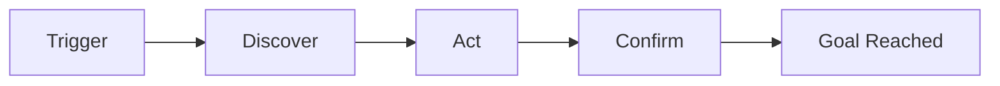

# Journey Map — `PRJ-XXXX`

> Owner: Journey Architect · Gate 1 · Persona: <name>

## Flow

## Stage Annotations
| Stage | User Goal | Emotion | Friction | Resolves In Screen |
|-------|-----------|---------|----------|--------------------|
| Trigger | | 😐 | | |
| Discover | | 🙂 | | |
| Act | | 😟 | | |
| Confirm | | 😀 | | |

## Ranked Friction Log
1. **[High]** …
2. **[Med]** …
3. **[Low]** …

> Rule: every later feature MUST trace to a stage above (Design is Truth).
